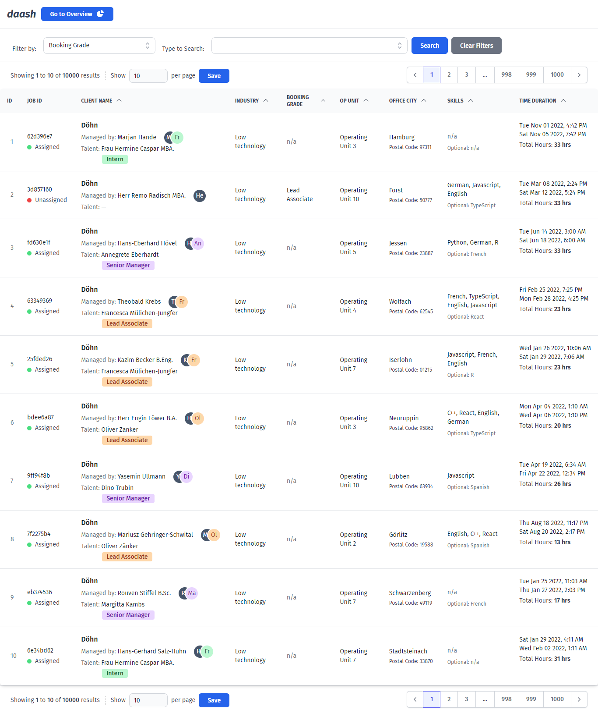
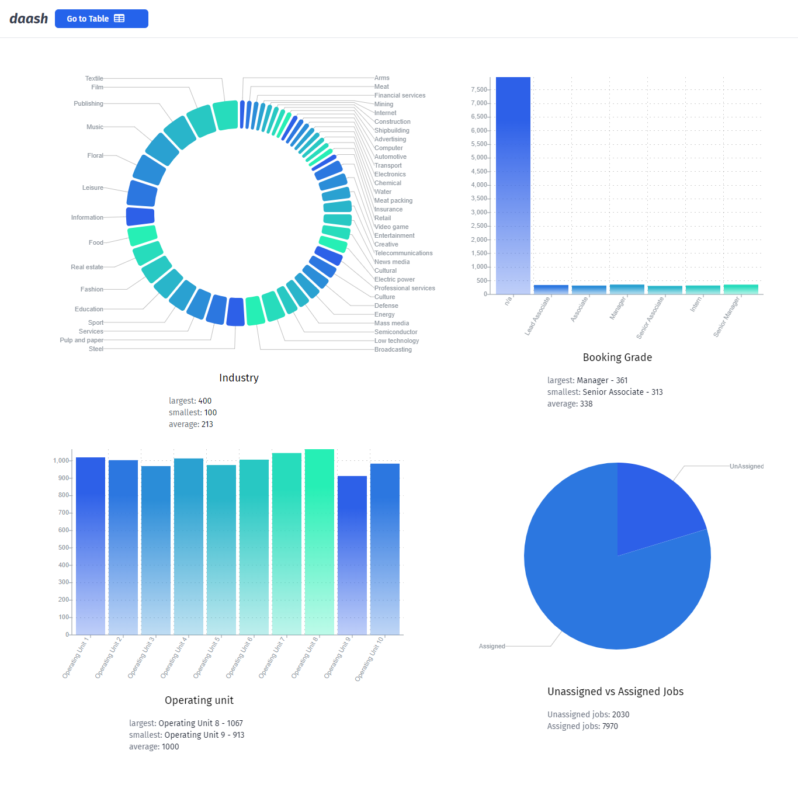

# React Coding Challenge

Meet **_daash_** 🦅, the dashboard that gives super-vision to your planning teams, by giving insights into data 📊 - from the superheroes 🦸‍♂️🦸‍♀️🦸🏼‍♀️🦸🏽‍♂️ at Aspaara!

## To run

- Clone with `git clone https://github.com/Chizaram-Igolo/react-coding-challenge.git`
- `cd` into folder
- Install all dependencies with `npm install`
- Start application with `npm run start` and
- Open `localhost:3000` in your browser to view.

## Screenshots

## Dashboard (Table) view

## Overview (Graphs) view

## Product Specification

A SPA that:

- Tabulates the given data and makes it navigable.
- Allows filtering and sorting of columns.
- Presents statistical overview.

### User Stories

As derived from the requirements given in the assessment.

- As a user, I want my planning data in tabular view so that I can browse through it.
- As a user, I want to get a graphical representation of at least one of:
  - booking grade
  - office city
  - skill
  - industry,

so that I can tell how large or small a given item in the category is.

- As a user, I want to enter some text in a textfield and click a button so that I can filter the data by my entered text, on the table.
- As a user, I want to click a column heading on the table so that I can sort the data by that name in ascending order.
- As a user, I want to click the `skills` column heading on the table so that I can sort the data by number of `requiredSkills`, highest to lowest.

## Skills I demonstrated

- State management using React hooks
- Static type-checking with TypeScript
- Pagination, sorting and filtering of a fairly large dataset

## Stack

- React (with TypeScript)  
- Tailwind CSS 

## UI Libraries

#### No Install

- Buttons, Input Fields, Table, Badges, Avatars - Flowbite (https://flowbite.com)
- Combobox - Headless UI (https://headlessui.com/react/combobox)
- Pagination bar - Tailwind UI (https://tailwindui.com/)

#### Install required

- Icons - Heroicons (https://heroicons.com)
- Graphs - Reaviz (https://reaviz.io/)
- Routing - React Router Dom (https://reactrouter.com/)

## Font

- Fira Sans

Thank you for your time and consideration.
